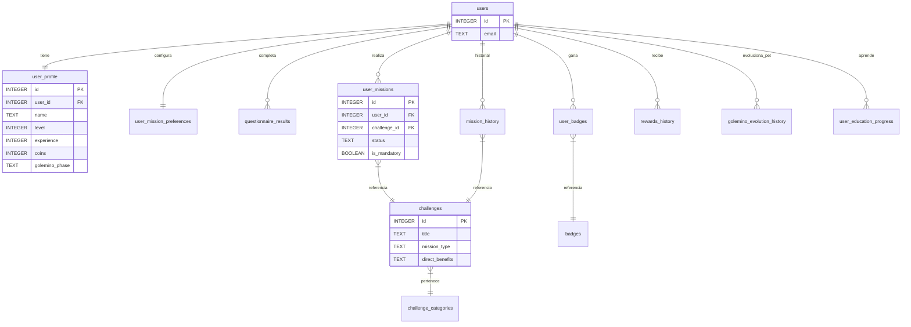

# Documentación de la Base de Datos - EcoHuella

> [!NOTE]
> Esta documentación refleja la estructura **unificada** de la base de datos PostgreSQL utilizada en el proyecto, alojada en **Supabase**. La configuración completa reside en `backend/src/config/database.js`.

## Visión General

La base de datos utiliza **PostgreSQL** en Supabase, gestionada mediante `pg` (node-postgres). El esquema ha sido consolidado para soportar todos los módulos del sistema:
- Autenticación y Perfil
- Huella de Carbono
- Gamificación y Misiones (Diarias/Semanales)
- Inventario de Insignias
- Mascota Virtual (Golemino)
- Módulo Educativo

## Diagrama Entidad-Relación (ER)

## Diccionario de Datos

### 1. Usuarios y Perfiles

#### `users`
Tabla principal de cuentas.
| Columna | Tipo | Descripción |
|---------|------|-------------|
| `id` | INTEGER | PK autoincremental. |
| `email` | TEXT | Correo único. |
| `password_hash` | TEXT | Hash de seguridad. |
| `created_at` | DATETIME | Registro. |
| `last_login` | DATETIME | Último acceso. |
| `is_first_login` | BOOLEAN | Flag de primer login. |

#### `user_profile`
Datos gamificados y estado del usuario.
| Columna | Tipo | Descripción |
|---------|------|-------------|
| `id` | INTEGER | PK. |
| `user_id` | INTEGER | FK a `users`. |
| `name` | TEXT | Nombre visible. |
| `avatar` | TEXT | Avatar emoji. |
| `age` | INTEGER | Edad. |
| `regional_footprint` | REAL | Referencia regional. |
| `base_footprint` | REAL | Huella inicial. |
| `current_footprint` | REAL | Huella con reducciones. |
| `level` | INTEGER | Nivel (1-50+). |
| `experience` | INTEGER | XP total. |
| `coins` | INTEGER | Brotos (Moneda). |
| `rank` | TEXT | Rango actual (ej. Semilla). |
| `rank_icon` | TEXT | Icono de rango. |
| `total_missions_completed` | INTEGER | Contador histórico. |
| `streak_days` | INTEGER | Racha actual. |
| `golemino_phase` | TEXT | Fase mascota (baby, young, titan). |
| `golemino_health` | INTEGER | Salud (0-100). |
| `golemino_status` | TEXT | Estado (healthy, sick). |
| `last_golemino_interaction` | DATETIME | Última vez alimentado/cuidado. |
| `golemino_fed_count` | INTEGER | Contador de alimentación. |

#### `user_mission_preferences`
Preferencias para asignar misiones personalizadas.
| Columna | Tipo | Descripción |
|---------|------|-------------|
| `id` | INTEGER | PK. |
| `user_id` | INTEGER | FK a `users`. |
| `time_availability` | TEXT | low, medium, high. |
| `zone_type` | TEXT | urban, rural. |
| `preferred_difficulty` | TEXT | easy, medium, hard. |
| `energy_completed` | INTEGER | Estadísticas por categoría... |
| ... | ... | (water, transport, food, waste) |

### 2. Sistema de Misiones (Challenges)

#### `challenge_categories`
Categorías temáticas (Energía, Agua, etc.).
| Columna | Tipo | Descripción |
|---------|------|-------------|
| `id` | INTEGER | PK. |
| `name` | TEXT | Nombre. |
| `icon` | TEXT | Icono. |
| `color` | TEXT | Color hexadecimal. |

#### `challenges`
Catálogo maestro de misiones.
| Columna | Tipo | Descripción |
|---------|------|-------------|
| `id` | INTEGER | PK. |
| `title` | TEXT | Título. |
| `description` | TEXT | Descripción. |
| `category_id` | INTEGER | FK a `challenge_categories`. |
| `type` | TEXT | 'real_action' (físico) o 'educational'. |
| `mission_type` | TEXT | 'daily' o 'weekly'. |
| `difficulty` | TEXT | easy, medium, hard. |
| `duration_days` | INTEGER | Días para completar (1 o 7). |
| `xp_reward` | INTEGER | XP otorgada. |
| `coins_reward` | INTEGER | Monedas otorgadas. |
| `direct_benefits` | TEXT | JSON con beneficios (económicos, salud). |

#### `user_missions`
Misiones activas o pasadas de un usuario.
| Columna | Tipo | Descripción |
|---------|------|-------------|
| `id` | INTEGER | PK. |
| `user_id` | INTEGER | FK a `users`. |
| `challenge_id` | INTEGER | FK a `challenges`. |
| `status` | TEXT | active, completed, failed. |
| `progress` | INTEGER | Días/veces realizadas. |
| `max_progress` | INTEGER | Meta (generalmente igual a duration_days). |
| `mission_type` | TEXT | Snapshot del tipo al asignar. |
| `is_mandatory` | BOOLEAN | Si es misión obligatoria del día. |
| `pool_date` | DATE | Fecha del "pool" de misiones. |
| `accepted_at` | DATETIME | Cuándo el usuario la aceptó. |
| `last_check_in` | DATE | Última fecha de progreso registrado. |

### 3. Educación y Progreso

#### `user_education_progress`
Registro de temas educativos completados.
| Columna | Tipo | Descripción |
|---------|------|-------------|
| `id` | INTEGER | PK. |
| `user_id` | INTEGER | FK a `users`. |
| `topic_id` | TEXT | ID del tema (string única). |
| `completed_at` | DATETIME | Fecha. |
| `brotos_earned` | INTEGER | Recompensa obtenida. |

### 4. Historiales y Varios

#### `mission_history`
Log inmutable de misiones completadas.
| Columna | Tipo | Descripción |
|---------|------|-------------|
| `id` | INTEGER | PK. |
| `user_id` | INTEGER | FK. |
| `challenge_id` | INTEGER | FK. |
| `completed_at` | DATETIME | Fecha fin. |
| `xp_earned` | INTEGER | Realmente ganada. |
| `coins_earned` | INTEGER | Realmente ganada. |

#### `golemino_evolution_history`
Registro de evoluciones de la mascota.
| Columna | Tipo | Descripción |
|---------|------|-------------|
| `id` | INTEGER | PK. |
| `user_id` | INTEGER | FK. |
| `from_phase` | TEXT | Fase origen. |
| `to_phase` | TEXT | Fase destino. |
| `brotos_spent` | INTEGER | Costo pagado. |

#### `questionnaire_results`
Resultados del test de huella de carbono.
- Incluye puntajes parciales (`transport_score`, `energy_score`, etc.) y el total (`total_footprint`).

#### `badges` & `user_badges`
Sistema de insignias y logros desbloqueados por los usuarios.
