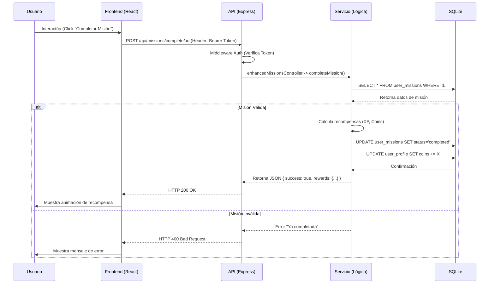

# Especificaciones y Flujo del Proyecto - EcoHuella

Este documento detalla los requerimientos del sistema, los casos de uso principales y el flujo técnico de información entre las capas de la aplicación.

## 1. Casos de Uso (Use Cases)

### CU-01: Gestión de Cuenta
- **Actor**: Usuario no registrado / registrado.
- **Descripción**: El usuario puede crear una cuenta nueva y autenticarse en el sistema.
- **Flujo**: Registro -> Hash de contraseña -> Generación de JWT -> Acceso a Dashboard.

### CU-02: Cálculo de Huella de Carbono
- **Actor**: Usuario registrado.
- **Descripción**: El usuario completa un cuestionario categorizado (Transporte, Energía, etc.) para establecer su línea base de impacto ambiental.
- **Resultado**: Se guarda el puntaje y se desbloquea el acceso completo a las misiones.

### CU-03: Realización de Misiones Diarias
- **Actor**: Usuario.
- **Descripción**: El usuario visualiza, acepta y marca progreso en misiones ecológicas asignadas para el día (ej: "Apagar luces").
- **Resultado**: Al completar, recibe XP y Monedas (Brotos).

### CU-04: Evolución de Mascota (Golemino)
- **Actor**: Usuario.
- **Descripción**: El usuario interactúa con su mascota virtual (alimentar, jugar) y la evoluciona usando las monedas ganadas.
- **Pre-condición**: Tener saldo suficiente de "Brotos".

### CU-05: Consulta a Asistente IA (EcoBot)
- **Actor**: Usuario.
- **Descripción**: El usuario realiza preguntas sobre sostenibilidad en el chat integrado.
- **Flujo**: Input Usuario -> Backend -> API Groq (LLM) -> Respuesta Contextual -> Frontend.

## 2. Requerimientos del Sistema

### 2.1. Requerimientos Funcionales (RF)

- **RF-01**: El sistema debe permitir el registro de usuarios con email único y contraseña encriptada.
- **RF-02**: El sistema debe asignar automáticamente un set de misiones diarias a las 00:00 hora local.
- **RF-03**: El sistema debe calcular la experiencia (XP) necesaria para subir de nivel y actualizar el rango (Semilla, Brote, Árbol...) automáticamente.
- **RF-04**: El sistema debe validar que un usuario no pueda reclamar la recompensa de una misma misión más de una vez por asignación.
- **RF-05**: La mascota virtual debe cambiar de estado a "Enfermo" si el usuario pasa más de 3 días inactivo (lógica de racha).
- **RF-06**: El chat de IA debe mantener el contexto de la conversación durante la sesión.

### 2.2. Requerimientos No Funcionales (RNF)

- **RNF-01 (Rendimiento)**: Las respuestas de la API no deben exceder los 500ms en condiciones normales.
- **RNF-02 (Seguridad)**: Toda comunicación debe realizarse sobre HTTPS (en producción) y los endpoints críticos deben exigir token JWT válido.
- **RNF-03 (Usabilidad)**: La interfaz debe ser responsiva y funcional en dispositivos móviles y de escritorio.
- **RNF-04 (Persistencia)**: La integridad de los datos relacionales (Foreign Keys) debe garantizarse en la base de datos SQLite.

## 3. Flujo de Comunicación y Arquitectura

El sistema sigue un flujo unidireccional de datos típico de aplicaciones SPA (Single Page Application) con API REST.

### Diagrama de Secuencia General

### Detalle del Flujo de Datos

1.  **Capa de Presentación (Frontend)**:
    *   Gestiona el estado visual y la interacción.
    *   Utiliza `axios` y `interceptors` para inyectar credenciales.
    *   Maneja errores de red y validaciones básicas de formulario.

2.  **Capa de Servicio (Backend API)**:
    *   Recibe peticiones JSON.
    *   **Autenticación**: Desempaqueta el JWT para identificar el `userId`.
    *   **Orquestación**: Decide qué servicios invocar (ej: al completar una misión, llama a `gamificationService` para ver si el usuario subió de nivel).

3.  **Capa de Datos (Persistencia)**:
    *   Modelo relacional estricto.
    *   Las transacciones (usando `db.transaction` de `better-sqlite3`) aseguran que operaciones complejas (como gastar monedas para evolucionar) sean atómicas: o se hacen todos los cambios o ninguno.

4.  **Integraciones Externas**:
    *   Para el chat, el backend actúa como proxy seguro hacia la API de **Groq**, protegiendo la API Key que nunca se expone al frontend.
